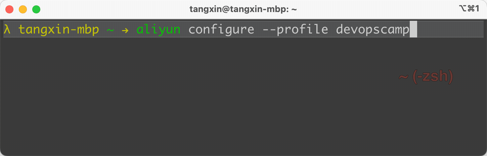
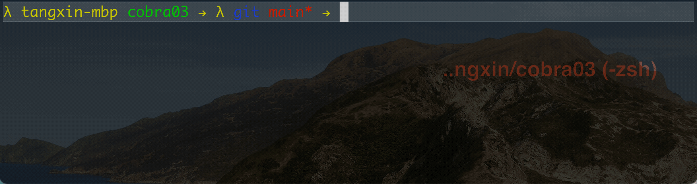

# 作业: cobra - 03 交互式命令

要求:

1. 使用 https://github.com/spf13/cobra 实现命令工具
2. 使用 https://github.com/go-survey/survey 实现交互式命令

3. 实现 Demo 效果


除了官方效果之外， 我还发现了 `aliyun` 命令行工具在配置账户的时候使用的是 **交互式** ， 如下



为了更好的体现 **实战性**， 我们将以 `aliyun configure --profile` 的作为例子， 并进行一些优化。


## 解题过程

### 1. 安装 `survey` 依赖

这是一个意外收获， survey 库的 Github 地址与 `go module` 名称不一致。 同时， `survey` 版本还是 v2 了。

关于 `go module version` ， 参考文章： ？？？？

话说回来， 虽然 github 仓库地址是 `https://github.com/go-survey/survey` ， 但安装库需要使用命令

```bash
$ go get -u github.com/AlecAivazis/survey/v2
```

在 [`go.mod`](https://github.com/go-survey/survey/blob/master/go.mod) 第一行中, 也可以看到 module 的名称

```go.mod
module github.com/AlecAivazis/survey/v2
```

平时在使用的时候， 应该多注意官方文档的 `Usage`、 `exmaple` 或者 `_test.go` 等。


### 2. 需要使用的交互组件

`survey` 提供了很多组件类型以及 `Option` 参数、 **验证器** 等功能，非常全面。 在这里简单介绍常用的几种

1. `Input` 组件： 普通输入框， 输入什么就显示什么。
2. `Password` 组件： 密码输入框， 输入的内容不直接显示， 使用 `*` 替代。
3. `Select` 组件： 单选框。
4. `MultiSelect` 组件： 多选框， 结果为 **切片** 类型。
5. `Confirm` 组件： 确认框， 结果为 **布尔** 类型。

更多其它组件， 可以参考官方文档。


### 3. 代码片段

参考 aliyun 命令行， 我们自己实现的功能需要以下字段。

1. Access Secret ID
2. Access Secret Key
3. Region
4. Language

代码中， 创建了 **匿名** struct ， 并创建 **实例** 赋值给 `answers`

```go
	answers := struct {
		ID          string
		Key         string
		ChinaRegion string `survey:"region"`
		Language    []string
	}{}
```

其中 `ChinaRegion` 字段通过 tag `survey:"region"` 指定了一个映射名字 `region`。  回想一下， 这种用法是不是和上一篇配置文件中的 `json, yaml` 字段的映射名字用法一样？

另一方面， 我们还准备了一系列问题， 引导用户输入

```go
// the questions to ask
var qs = []*survey.Question{
	{
		// 1. Input 输入框
		Name: "id",
		Prompt: &survey.Input{
			Message: "Access Secret ID: ",
		},
		Validate: survey.Required,
	},
	{
		// 2. Password 密码输入框
		Name: "key",
		Prompt: &survey.Password{
			Message: "Access Secret Key: ",
		},
		Validate: survey.Required,
	},
	{
		// 3. Select 单选框
		Name: "region",
		Prompt: &survey.Select{
			Message: "Choose a region:",
			Options: []string{"cn-shanghai", "cn-hangzhou"},
			Default: "cn-hangzhou",
		},
	},
	{
		// 4. MultiSelect 多选框
		Name: "language",
		Prompt: &survey.MultiSelect{
			Message: "Supported Configure Language: ",
			Options: []string{"zh", "en", "jp"},
		},
	},
}
```

1. `qs` 中的 `Name` 名称与 `answers` 中的字段名称都是一一对应的。
2. 在 `id` 和 `key` 字段， 设置了验证器， 要求 **必须提供**。
3. 在 `region` 字段， 设置 `cn-hangzhou` 为默认值， 虽然在切片中排在第二位。


另外， 我们还使用 `Confirm` 组件引导用户确认是否将输入内容保存到文件中。 由于 **保存确认** 并不需要保存到配置文件中， 因此我们将其单独封装在了 `confirm` 函数中。

```go
func confirm() bool {
	ok := false
	// 5. Confirm 确认框
	prompt := &survey.Confirm{
		Message: "是否保存文件?",
	}
	survey.AskOne(prompt, &ok)

	return ok
}
```

### 4. `JSON MashralIndent`

为了更好的可读性， 这次在保存配置文件的时候， 使用了 `MarshalIndent` 方法。

```json
{
  "ID": "AKID-demodemo-adsfasdf",
  "Key": "flasjdflaksdjf",
  "ChinaRegion": "cn-shanghai",
  "Language": [
    "zh",
    "en"
  ]
}
```

### 5. 全局 `profile` 字段

你可能已经注意到了， 目前所有的代码都在 `main` 包下面， 并没有 **划分目录结构**。

```go
var profile string
```

因此定义的 `profile` 是全局变量， 可以在 **任意位置** 直接使用。

但是我们在使用的时候并没有在函数中直接使用， 而是通过 **函数参数** 的方式传递下去的。 这是我们 **刻意** 回避直接在 `dumpConfig` 中直接使用 `全局的profile` 的。 

关于 **目录结构** 我们将会在后面的作业中提到。


## 效果展示


